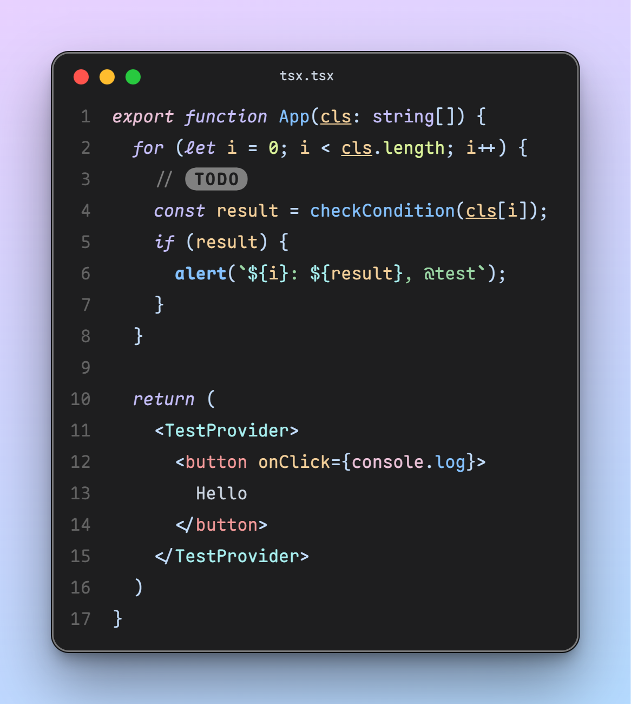

  </img>
  <h1 align="center">CodeImg</h1>

VSCode plugin that generate beautiful image for you code with your favorite font and theme

Powered by `Solid.js`

- Font: [Maple Mono](https://github.com/subframe7536/maple-font/tree/variable)
- Theme: [Maple](https://github.com/subframe7536/vscode-theme-maple)

## Why another one?

The popular existing extensions lack maintenance and have limited customization options. I spent some weekend time creating this extension, hoping to add a more modern UI and additional configuration options.

## Settings

The CodeImg extension allows you to customize various aspects of the code snippet's appearance and behavior. Here are the available settings:
### `codeimg.background`

The CSS background style for the snippet's container. Set it to `"none"` if you do not want a background.
- **Type:** `string`
- **Default:** `"linear-gradient(345deg, rgb(180, 218, 255) 0%, rgb(232, 209, 255) 100%)"`

### `codeimg.boxShadow`

The CSS box-shadow style for the snippet's container. Set it to `"none"` if you do not want a box-shadow.
- **Type:** `string`
- **Default:** `"medium"`
- **Options:** `"none"`, `"small"`, `"medium"`, `"large"`

### `codeimg.containerPadding`

The padding for the snippet's container.
- **Type:** `string`
- **Default:** `"3rem"`

### `codeimg.border`

Border for the snippet's container, which is only visible in the dark theme.
- **Type:** `boolean`
- **Default:** `true`

### `codeimg.debounce`

Whether to update the code snippet with debounce when selection changes.

- **Type:** `boolean`
- **Default:** `true`

### `codeimg.roundedCorners`

The CSS rounded corners style for the snippet's container. Set it to `"none"` if you do not want rounded corners.
- **Type:** `string`
- **Default:** `"1rem"`

### `codeimg.scale`

The scale of the screenshot.
- **Type:** `integer`
- **Default:** `2`

### `codeimg.format`

The format of the screenshot.

- **Type:** `string`
- **Default:** `"png"`
- **Options:** `"jpg"`, `"png"`, `"webp"`

### `codeimg.showWindowControls`

Display OS X style window controls.

- **Type:** `boolean`
- **Default:** `true`

### `codeimg.windowControlsColor`

Add color to the window controls.

- **Type:** `boolean`
- **Default:** `true`

### `codeimg.showWindowTitle`

Display the window title with the open folder or file name.

- **Type:** `boolean`
- **Default:** `true`

### `codeimg.showLineNumbers`

Display line numbers in the code snippet.

- **Type:** `boolean`
- **Default:** `true`

## credit

- [CodeSnap-plus](https://github.com/huibizhang/CodeSnap-plus)
- [ray.so](https://ray.so)
- [CodeImage](https://codeimage.dev/)
