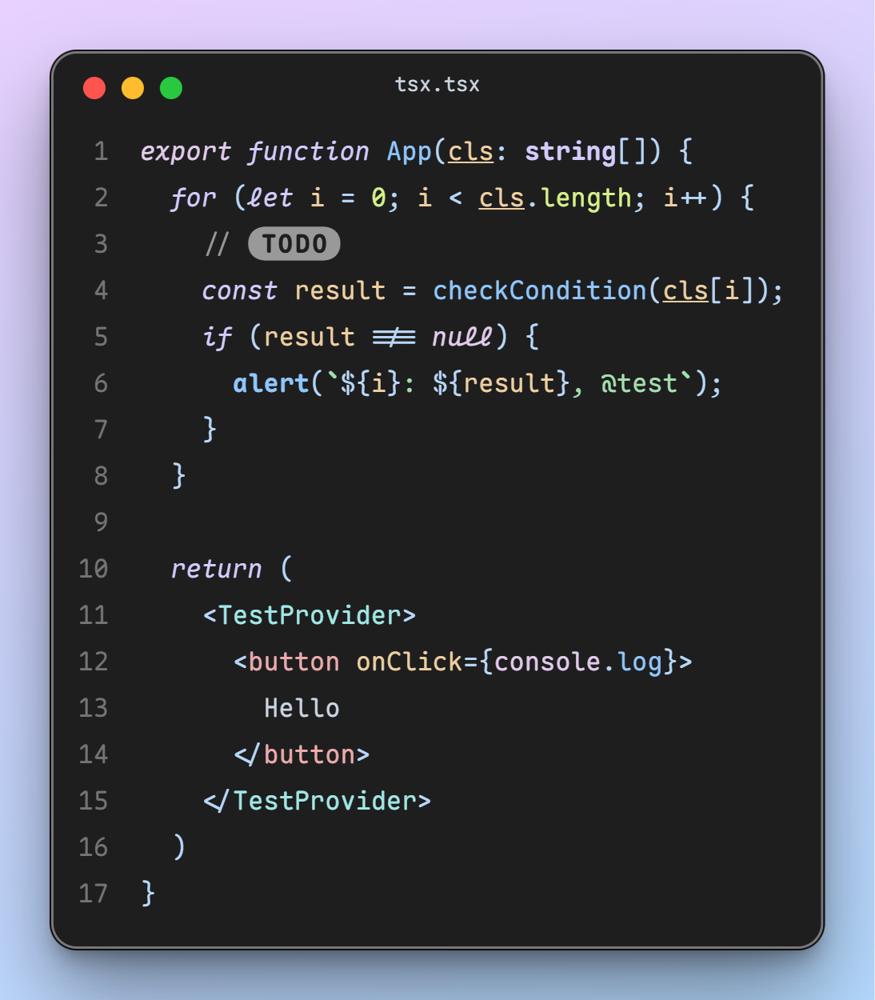
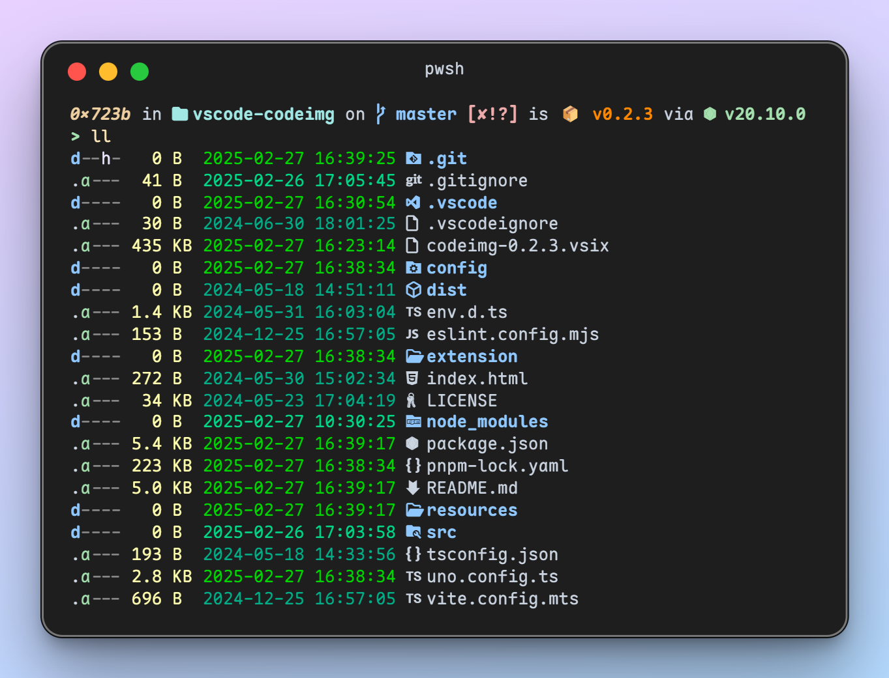

  </img>
  <h1 align="center">CodeImg</h1>

VSCode extension that generate beautiful image for you code and terminal with your favorite font and theme.

Powered by `Solid.js`.

## Why another one?

The popular existing extensions lack maintenance and have limited customization options. I spent some weekend time creating this extension, hoping to add a more modern UI and additional configuration options.

## How it works?

Call VSCode's built-in command to copy generated HTML text and render the parsed clipboard content.
- For code, use `editor.action.clipboardCopyWithSyntaxHighlightingAction`
- For terminal, use `workbench.action.terminal.copySelectionAsHtml`

## Features

- Generate beautiful image of code and terminal
- Copy or save image in `PNG` / `JPG` / `WEBP` format
- **Click line number to highlight lines in 3 styles**

## Showcase

Code:

Terminal:

- Font: [Maple Mono](https://github.com/subframe7536/maple-font/tree/variable)
- Theme: [Maple](https://github.com/subframe7536/vscode-theme-maple)

## Limitation

- No effect about `editor.bracketPairColorization`
- "pollute" your clipboard
- Snap on terminal cannot be updated if selection in terminal changed

## Configurations

<!-- configs -->

| Key                           | Description                                                                                 | Type      | Default                                                                 |
| ----------------------------- | ------------------------------------------------------------------------------------------- | --------- | ----------------------------------------------------------------------- |
| `codeimg.background`          | The CSS background of the snippet's container. If you don't want to it, set it `none`       | `string`  | `"linear-gradient(345deg, rgb(180 218 255) 0%, rgb(232 209 255) 100%)"` |
| `codeimg.boxShadow`           | The CSS box-shadow for the snippet's container. If you don't want to it, set it `none`      | `string`  | `"medium"`                                                              |
| `codeimg.containerPadding`    | The CSS padding for the snippet's container. If you don't want to it, set it `none`         | `string`  | `"3rem"`                                                                |
| `codeimg.border`              | Border for the snippet's container. Only in dark theme                                      | `boolean` | `true`                                                                  |
| `codeimg.debounce`            | Whether to update the code snippet with debounce when selection changes                     | `boolean` | `true`                                                                  |
| `codeimg.roundedCorners`      | The CSS rounded corners for the snippet's container. If you don't want to it, set it `none` | `string`  | `"1rem"`                                                                |
| `codeimg.scale`               | The scale of the screenshot                                                                 | `number`  | `2`                                                                     |
| `codeimg.format`              | The format of the screenshot                                                                | `string`  | `"png"`                                                                 |
| `codeimg.terminalLineHeight`  | Line height of terminal when generating terminal image                                      | `number`  | `1.3`                                                                   |
| `codeimg.showWindowControls`  | Display OS X style window controls                                                          | `boolean` | `true`                                                                  |
| `codeimg.windowControlsColor` | Add color in window controls                                                                | `boolean` | `true`                                                                  |
| `codeimg.showWindowTitle`     | Display window title with open folder / file name                                           | `boolean` | `true`                                                                  |
| `codeimg.showLineNumbers`     | Display line numbers                                                                        | `boolean` | `true`                                                                  |

<!-- configs -->

## Commands

<!-- commands -->

| Command                     | Title                          |
| --------------------------- | ------------------------------ |
| `codeimg.generate.code`     | CodeImg: generate code 📷      |
| `codeimg.generate.terminal` | CodeImg: generate terminal 🛠️ |

<!-- commands -->

## credit

- [CodeSnap-plus](https://github.com/huibizhang/CodeSnap-plus)
- [ray.so](https://ray.so)
- [CodeImage](https://codeimage.dev/)
